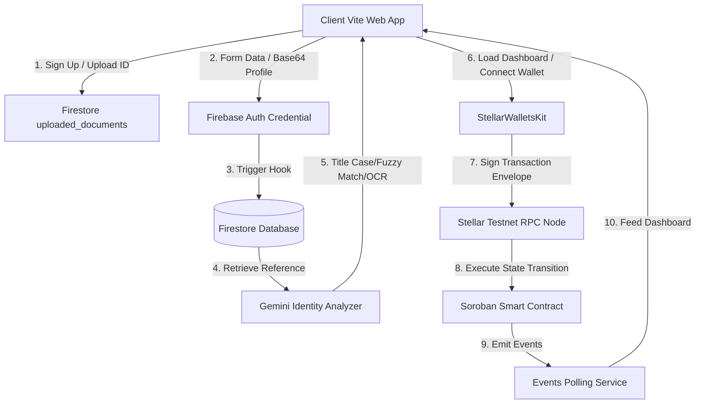
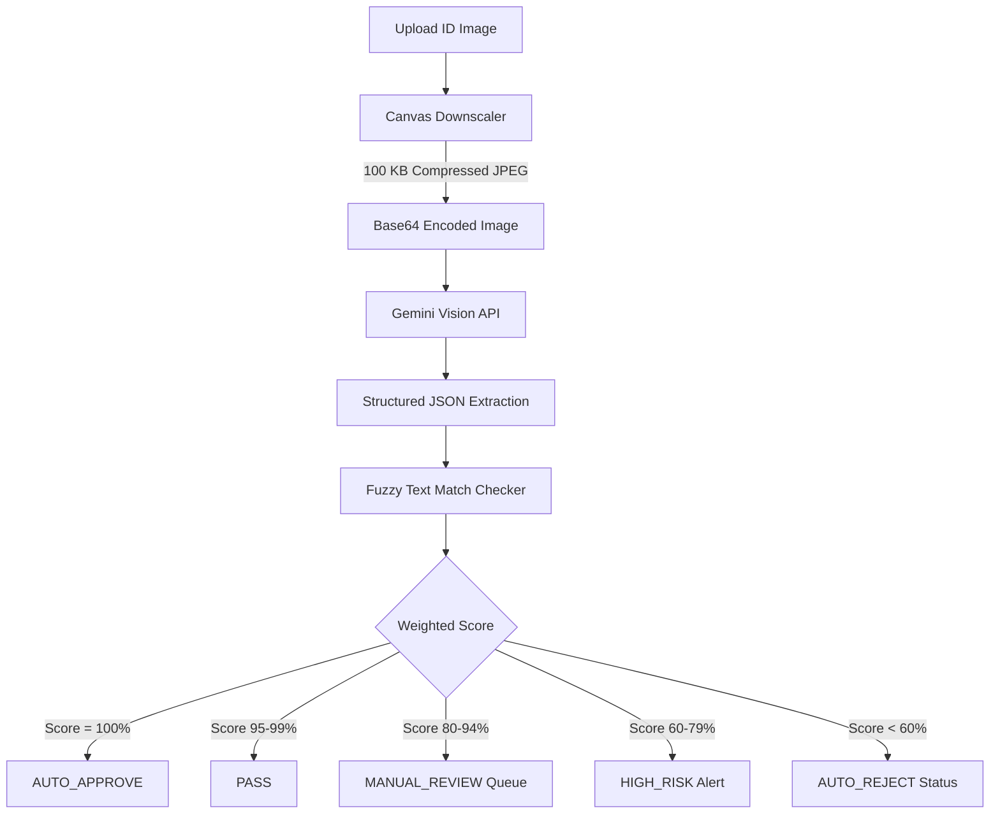
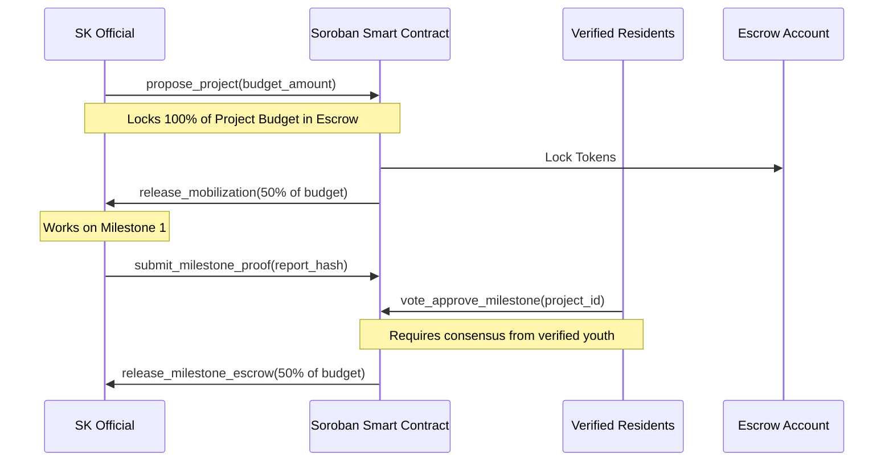

# 🇵🇭 Barangay Bond

> Milestone-Based Youth Governance & Civic Accountability Platform
> Deployed on **Stellar Soroban Testnet** and powered by **Firebase** and **Google Gemini AI**.

---

[](https://github.com/FWDP/barangay-bond)
[](https://stellar.org)
[](https://stellar.org/soroban)
[](https://firebase.google.com)
[](https://deepmind.google/technologies/gemini)
[](https://vite.dev)
[](https://react.dev)
[](https://typescriptlang.org)
[](https://opensource.org/licenses/MIT)

---

## 📖 Table of Contents

- [Overview](#-overview)
- [Problem & Solution](#-problem--solution)
- [System Architecture](#-system-architecture)
- [User Roles & Permissions](#-user-roles--permissions)
- [User Journeys](#-user-journeys)
- [AI Identity Verification Pipeline](#-ai-identity-verification-pipeline)
- [Smart Contract Escrow Flow](#-smart-contract-escrow-flow)
- [Firestore Collections Schema](#-firestore-collections-schema)
- [Security Checklist](#-security-checklist)
- [Tech Stack](#-tech-stack)
- [Environment Variables](#-environment-variables)
- [Local Setup & Installation](#-local-setup--installation)
- [Folder Structure](#-folder-structure)
- [Project Roadmap](#-project-roadmap)
- [License & Authors](#-license--authors)

---

## 🌟 Overview

**Barangay Bond** is a decentralized platform built specifically for **Sangguniang Kabataan (SK)** youth governance in the Philippines. It bridges web-based identity verification and local trust structures with public blockchain networks. By pairing **Stellar Soroban smart contracts** with **Google Gemini Vision AI** and **Firebase**, Barangay Bond guarantees that public civic budgets are locked in auditable escrow agreements, releasing funds transparently only when verified local youth residents vote to approve project milestones.

---

## 🛑 Problem & Solution

### The Problem
* **Centralized Discretion:** Local youth development funds are susceptible to delays, opaque accounting, and lack of direct resident consensus.
* **Low Civic Engagement:** Youth residents lack simple, interactive channels to audit local projects, vote on fund releases, and track progress.
* **Identity Spoofing & Sybil Risks:** Online voting and project registration are prone to fake profiles, duplicate accounts, and non-resident participation.

### The Solution
* **Milestone-Based Escrows:** Budgets are locked on-chain in smart contracts. A 50% mobilization fund is released on launch, with the remaining 50% locked until residents verify proof of milestone completion.
* **AI-Cross-Validated Identity:** Gemini AI analyzes government/student IDs against registration fields, matching initials, hyphenations, and title casing to catch fraud.
* **Duplicate Identity Scanners:** Multi-factor fuzzy database checks compare names, birthdates, phone numbers, and IDs to block duplicate enrollments before admin review.
* **On-Chain Audit Trails:** Every voter registration, project proposal, milestone proof, and fund release is logged immutably via contract events.

---

## 🏗️ System Architecture

Barangay Bond implements a secure, modular architecture combining off-chain coordination (Firebase + Gemini AI) with on-chain trust (Stellar Soroban).



---

## 👥 User Roles & Permissions

The platform enforces a strict hierarchical access control matrix tailored to LGU boundaries:

```
SYSTEM ADMIN ──► Approves Barangays & Barangay Admins, Suspends Barangay Admins
     │
     └──► BARANGAY ADMIN ──► Verifies Resident IDs, Approves Residents, Assigns SK Officials
               │
               ├──► SK OFFICIAL ──► Proposes Projects, Locks Escrow, Uploads Milestone Proof
               │
               ├──► RESIDENT ──► Votes on Milestones, Audits Budgets, Views Transparency Portal
               │
               └──► VIEWER ──► Read-only observer of public transparency ledgers
```

### Roles Matrix
* **System Admin:** Off-chain validator of platform boundary integrity. Configures active Barangays, reviews Barangay Admin credentials, and suspends malicious accounts.
* **Barangay Admin:** Direct local moderator. Manages the verification queue, audits ID mismatches, and assigns active residents to official SK roles.
* **SK Official:** Civic builder. Proposes local development projects, locks budgets into Soroban contracts, and submits photo/document proof for milestone reviews.
* **Resident:** Local voter and auditor. Connects a Stellar wallet to vote on active milestone releases and audit ledger balances.
* **Viewer:** Public auditor. Browse logs, budgets, and project completions read-only without requiring registration or wallet connection.

---

## 🗺️ User Journeys

### Guest & Resident Journey
```
Guest ──► Sign Up ──► Base64 Compression ──► Duplicate Scan ──► Gemini OCR Match ──► Auto-Signout ──► Pending Queue ──► Barangay Admin Approves ──► Wallet Link ──► Active Resident ──► Vote on Milestone
```

### Sangguniang Kabataan (SK) Journey
```
Active Resident ──► Assigned SK Role ──► Wallet Connect ──► Propose Project ──► Lock Escrow (100% Budget) ──► Auto-Release Mobilization (50%) ──► Work Milestone ──► Upload Proof ──► Await Youth Vote ──► Release Escrow (50%)
```

---

## 🤖 AI Identity Verification Pipeline

To bypass manual registration overhead, Barangay Bond uses **Gemini 2.5 Flash** to perform structured visual document verification:



---

## 🔒 Smart Contract Escrow Flow

Budgets are guarded on-chain by the `barangay_bond` Soroban contract:



---

## 📊 Firestore Collections Schema

The platform organizes its off-chain profiles, verification requests, and transparency feeds in a normalized Firestore schema:

| Collection | Purpose | Security Rules |
| :--- | :--- | :--- |
| `users` | Holds accounts data (names, roles, status, scores) | User can write own profile. Admins can read/modify. |
| `barangay_admin_requests` | Holds pending admin applicants queue | Write on signup. Read/Update by System Admin only. |
| `resident_verification_queue` | Holds resident applicants for ID reviews | Write on signup. Read/Update by Barangay Admin only. |
| `barangays` | Master directory of approved local LGUs | System Admin creates/approves. Public read. |
| `uploaded_documents` | Hosts Base64-compressed ID and selfie files | Write on signup. Admins can read. No public read. |
| `ai_verifications` | Logs detailed Gemini scorecards and reason codes | System Admin and Barangay Admin read-only. |
| `projects` | Local development project status and metadata | SK Official writes. Public read. |
| `milestones` | Milestones verification and proof logs | SK Official writes. Public read. |
| `wallet_links` | Links Firestore UIDs to public Stellar keys | Owner writes. Public read to verify voter credentials. |
| `audit_logs` | Immutable audit trial of all administration tasks | Written by system context. Admins can read. |

---

## 🛠️ Security Checklist

* **Data Isolation:** All sensitive identity documents (Base64 images) are placed in `/uploaded_documents`, completely isolated from general user profiles to prevent data harvesting.
* **Anti-Enumeration Rules:** Unauthenticated users cannot read or search the `users` collection. Duplicate scanning for guest signups is wrapped in safe client blocks and computed securely on the administrator panel.
* **Role Verification Hooks:** Access states (`pending`, `suspended`, `inactive`) are evaluated synchronously on both `signIn` and `onAuthStateChanged` callbacks, preventing active session hijacks.
* **Smart Contract Ownership:** Critical contract actions (`verify_resident`, `assign_sk`) require on-chain signatures matching the authorized Barangay Admin wallet address.
* **Self-Verification Lock:** Barangay Admins are blocked from verifying their own profiles or altering their own roles via firestore rules.

---

## 💻 Tech Stack

* **Frontend Framework:** React 19, TypeScript 6, Vite 8
* **Styling Engine:** Vanilla CSS (Glassmorphism & Micro-animations)
* **Off-Chain Backend:** Firebase (Auth, Firestore, Cloud Rules)
* **AI Analysis:** Google Gemini 2.5 Flash API
* **Blockchain Core:** Stellar Network, Soroban Smart Contracts (Rust)
* **Wallet Kit:** `@creit-tech/stellar-wallets-kit` (Freighter / xBull integration)

---

## 🔑 Environment Variables

Create a `.env` file at the root of the project to configure your API integrations:

```env
# Gemini API Key (Identity document visual verification)
VITE_GEMINI_API_KEY=AIzaSy...

# Firebase Client Configuration
VITE_FIREBASE_API_KEY=AIzaSy...
VITE_FIREBASE_AUTH_DOMAIN=tugma-8514e.firebaseapp.com
VITE_FIREBASE_PROJECT_ID=tugma-8514e
VITE_FIREBASE_STORAGE_BUCKET=tugma-8514e.firebasestorage.app
VITE_FIREBASE_MESSAGING_SENDER_ID=578517024363
VITE_FIREBASE_APP_ID=1:578517024363:web:5ed04cf894eb1e73f4bb2e
VITE_FIREBASE_MEASUREMENT_ID=G-874ELHD8J6
```

---

## ⚙️ Local Setup & Installation

### Prerequisites
* Node.js v22.14.0+ & npm v11.2.0+
* Rust 1.95.0+ with target `wasm32v1-none`
* Stellar CLI 26.0.0+
* A Stellar wallet browser extension (e.g., Freighter) configured for **Stellar Testnet**.

### Setup Instructions

1. **Clone the Repository:**
   ```bash
   git clone https://github.com/FWDP/barangay-bond.git
   cd barangay-bond
   ```

2. **Initialize Environment Configuration:**
   Create a `.env` file in the root directory and populate your Firebase client keys and Gemini API key.

3. **Install Frontend Dependencies:**
   ```bash
   npm install
   ```

4. **Run the Vite Local Server:**
   ```bash
   npm run dev
   ```
   *Navigate to `http://localhost:5173` to interact with the platform.*

---

## 📂 Folder Structure

```
barangay-bond/
├── contracts/                  # Soroban Smart Contract source code (Rust)
│   └── contracts/barangay-bond/src/lib.rs
├── docs/                       # Project Documentation assets
│   ├── screenshots/            # UI Polished Screens
│   └── README-assets/          # Visual Diagrams
├── src/                        # React Frontend Core
│   ├── components/             # Reusable UI Panels & Modals
│   ├── contexts/               # React Auth & State Providers
│   ├── events/                 # Stellar RPC event polling listeners
│   ├── hooks/                  # Stellar contract react state hooks
│   ├── rpc/                    # Horizon transaction simulation client
│   ├── services/               # Firebase & Gemini API integrations
│   ├── transactions/           # Stellar keypair submit handlers
│   ├── utils/                  # Input normalization & Image compressors
│   └── types/                  # TypeScript interface specs
└── firestore.rules             # Security access configurations
```

---

## 🗺️ Project Roadmap

- [x] **Phase 1: Foundation Setup** — Web3 wallet integration, user roles logic, and layout routing.
- [x] **Phase 2: On-Chain Escrow** — Deployed the `barangay_bond` Soroban contract for milestone payouts.
- [x] **Phase 3: AI Document Auditing** — Built Gemini Vision visual document OCR and matching.
- [x] **Phase 4: Security Hardening** — Implemented client-side compression, queue isolation, and status intercepts.
- [ ] **Phase 5: Push Notifications** — Real-time SMS alerts for resident approvals.
- [ ] **Phase 6: Multi-Barangay Expansion** — Full cross-boundary multi-tenant support for larger LGUs.

---

## 📄 License & Authors

* **License:** Distributed under the MIT License. See [LICENSE](LICENSE) for more details.
* **Authors:** Built with 💛 by FWDP / Barangay Bond Development Team.
