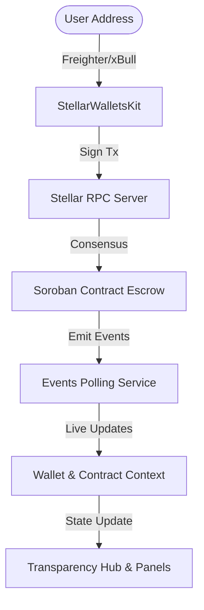

# Barangay Bond 🟡 (Level 2 Yellow Belt Submission)

Barangay Bond is a decentralized youth governance, transparency catalog, and milestone-based project financing platform built on the **Stellar Network** using **Soroban Smart Contracts**.

It enables transparent allocations of community budgets, role verification, and milestone escrows that release funds automatically based on on-chain votes cast by verified local youth residents.

---

## 🏗️ System Architecture

The application has a strict separation of concerns, dividing on-chain consensus, wallet coordination, RPC communications, state polling, and React components.



### Key Modules

- **Smart Contract (`contracts/`)**: Written in Rust using Soroban SDK v25. Manages admin actions, verified roles (`VerifiedYouth`, `SKOfficial`), budget locks, mobilization payments, and voting thresholds.
- **Wallet Abstraction (`src/wallet/`)**: Integrates `@creit-tech/stellar-wallets-kit` using static class methods to discover, connect, disconnect, and request signatures from Freighter, xBull, Albedo, or Lobstr.
- **RPC Client (`src/rpc/`)**: Implements client-side transaction simulation and sequence-fetching from Horizon. Auto-generates the preparation footprint envelope needed for Soroban.
- **Events Polling (`src/events/`)**: Polls the Stellar RPC for `#[contractevent]` updates. Automatically parses XDR event topics and values, converting them into friendly notifications.
- **Transaction Lifecycle (`src/transactions/`)**: Orchestrates the transaction states: `Pending` -> `Submitted` -> `Confirmed` / `Failed`.
- **UI Components (`src/components/`)**: Visual elements styled with premium dark glassmorphic styling (no Tailwind CSS, maximum flex vanilla design).

---

## 🌟 Level 2 Features & Compliance

✅ **Multi-Wallet Support**: True multi-wallet abstraction layer utilizing StellarWalletsKit. Fully compatible with Freighter, xBull, Albedo, and Lobstr. No hardcoded logic.
✅ **Deployed Soroban Contract**: Contract actively deployed on Testnet at:  
👉 `CCJYQG5OTMKW3HCA73ISFLUX3ZDBKKX4JT7ZLD7ZFPS7POGZJ2C3ZDJP`  
👉 wrapped native XLM asset: `CDLZFC3SYJYDZT7K67VZ75HPJVIEUVNIXF47ZG2FB2RMQQVU2HHGCYSC`
✅ **Real-Time Event Synchronization**: Auto-polls RPC events, automatically refreshing project statuses and balance values across the UI without manual reloads.
✅ **Visual Transaction Tracker**: Real-time modal showing transaction steps (`Pending` -> `Submitted` -> `Confirmed` / `Failed` / `WalletCancelled` / `SimulationError` / `NetworkError`). Exposes transaction hash links to Stellar Expert Explorer.
✅ **Robust Error Handling**: Standardized error wrappers that capture wallet rejection, uninstalled extensions, network timeout, contract panic, wrong passphrase, and invalid addresses. Exposes clean diagnostics.

---

## 🛠️ Local Installation & Development

### Prerequisites

- Node.js v22.14.0+ & npm 11.2.0+
- Rust 1.95.0+ with target `wasm32v1-none`
- Stellar CLI 26.0.0+
- A Stellar wallet browser extension (Freighter, xBull, etc.) configured for **Testnet**.

### Setup Instructions

1. **Clone the Repository:**
   ```bash
   git clone https://github.com/FWDP/barangay-bond.git
   cd barangay-bond
   ```

2. **Install Frontend Dependencies:**
   ```bash
   npm install
   ```

3. **Run the Development Server:**
   ```bash
   npm run dev
   ```

---

## 📜 Smart Contract Deployment Guide

If you wish to compile and redeploy the smart contract:

1. **Add compilation target:**
   ```bash
   rustup target add wasm32v1-none
   ```

2. **Compile the contract:**
   ```bash
   cd contracts
   cargo build --target wasm32v1-none --release
   ```
   *The contract WASM is created at `contracts/target/wasm32v1-none/release/barangay_bond.wasm`.*

3. **Deploy to Testnet:**
   ```bash
   stellar contract deploy \
     --wasm target/wasm32v1-none/release/barangay_bond.wasm \
     --source <YOUR_IDENTITY> \
     --network testnet
   ```

4. **Initialize the contract:**
   ```bash
   stellar contract invoke \
     --id <CONTRACT_ID> \
     --source <YOUR_IDENTITY> \
     --network testnet \
     -- initialize \
     --admin <ADMIN_ADDRESS> \
     --token CDLZFC3SYJYDZT7K67VZ75HPJVIEUVNIXF47ZG2FB2RMQQVU2HHGCYSC
   ```

---

## 🚀 Level 2 MVP Walkthrough Demo Instructions

To test the complete end-to-end flow:

1. **Setup Admin:** Initialize your contract with your local wallet address as the Admin.
2. **Setup Users:** Have two testnet accounts representing a Youth Resident and an SK Official.
3. **Admin Verification:**
   - Go to the **Admin Console** tab.
   - Input the SK Official's address and choose **SK Official (Project Creator)** -> click **Execute Role Verification**.
   - Input the Youth Resident's address and choose **Youth Resident (Voter)** -> click **Execute Role Verification**.
4. **SK Official Creates Project:**
   - Disconnect and connect the SK Official's wallet.
   - Go to the **SK Official Workspace** tab.
   - Input project details (e.g. WiFi Hub, budget: 10 XLM) -> click **Lock Escrow & Deploy Project**.
   - Review your wallet balance: 10 XLM will be locked in the escrow contract, and 5 XLM (50% mobilization) is immediately returned to you.
5. **SK Official Submits Proof:**
   - Under the **Milestone Work Audit** section, select the project.
   - Input an audit link (e.g., proof report URL) -> click **Submit Milestone 1 Proof**.
6. **Youth Resident Votes:**
   - Disconnect and connect the Youth Resident's wallet.
   - Go to the **Youth Resident Portal** tab.
   - The project is now listed under public voting. Click **Approve Milestone**.
   - Repeat the vote with a second verified youth resident account. Once the 2nd approval vote is confirmed, the smart contract automatically triggers the escrow release, transferring the remaining 5 XLM to the SK Official.
7. **View Transparency Dashboard:**
   - Switch to the **Transparency Catalog** tab. The project catalog immediately marks the project as `Completed (Released)`. The **Live On-Chain Event Feed** prints the logs for role registration, project launch, proof upload, and final escrow payment.

---

## 🗺️ Roadmap & Level 3 Readiness

Our Level 2 design is ready to evolve into **Level 3 (Orange Belt)** without major rewrites:
- **Comprehensive Smart Contract Tests**: Already contains a simulated unit test suite verifying locks, balances, and role configurations.
- **CI/CD Pipeline**: Simple scripts to run `cargo test` and `npm run build` automated on commits.
- **Multi-Milestones**: Scalable structure that can easily expand milestone arrays beyond Milestone 1.

---

## 📄 License

This project is licensed under the MIT License.
